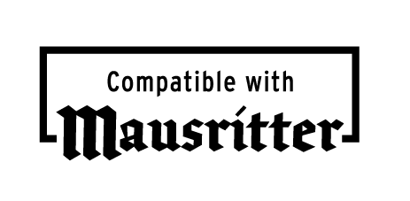

# Mausritter Third Party Licence

This document is available on the Web site at [https://mausritter.com/third-party-licence/](https://mausritter.com/third-party-licence/).

This licence allows anyone to make adventures, beasts, spells or hacks for Mausritter and sell or publish for free. 

## Rules
If you follow these rules you are allowed to publish free or commercial material based upon or declaring compatibility with Mausritter without express permission from Losing Games.

Without explicit permission, you **may not**:

- Copy or translate the art or text of the Mausritter book
- Use the Losing Games, Games Omnivorous or Mausritter logos
- State or imply that your work is an offical Mausritter product, or that it is endorsed by Losing Games

You **may**:

- Use, copy and modify the item card templates and item card art
- Use, reference and modify the game rules and mechanics
- Reference any locations, creatures, characters or factions mentioned in the Mausritter book

## Legal
The following text must be included somewhere visible within your publication, and on the website or storefront where you promote the product:

> [Product name] is an independent production by [Author or Publisher] and is not affiliated with Losing Games. It is published under the Mausritter Third Party Licence.

This copyright text must be legibly included somewhere on the product: 

>Mausritter is copyright Losing Games.

Losing Games takes no responsibility for any legal claims against your product.

## Compatibility logo
You are allowed and encouraged (but are not required to) use the “Compatible with Mausritter” logo in your product, and on the website or storefront where you promote the product.

[Download](./public/compatible%20with%20Mausritter%20logo.zip)

# What makes it Mausritter?

Mausritter is about small-scale adventurers in a huge world. Mouse adventurers who take on big challanges and face down grave danger.

Make it small and dense. Leave liminal space to be filled by the players.

Mausritter can sometimes contain dark themes under the surface, but don't publish anything that contains sexist, racist, homophobic, transphobic or hateful content and tropes.

## Website listing
We love to feature the creativity and work of Mausritter's community!

To be listed under the Third party adventures and resources:

- Conform to the rules of the Third Party Licence
- Finish your product and publish it online
- Send a 800x1120px cover image and a link to your product to @mausritter on Twitter, or post both in the #third-party-products channel on the Mausritter discord

Mausritter ©2020 Isaac Williams & Losing Games
