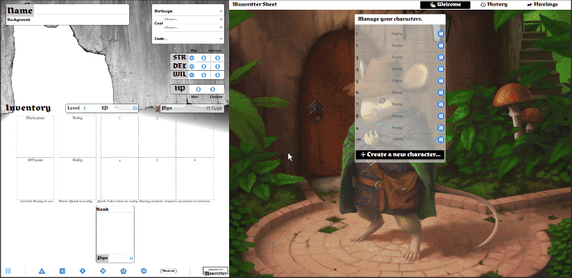

# mausritter-sheet

[](https://mausritter.com/third-party-licence/)

**Mausritter Character Sheet** is a web application for **Mausritter** mice character sheet. You can use it, freely, from https://mausritter-sheet.dco.ninja.

> Mausritter is about small-scale adventurers in a huge world. Mouse adventurers who take on big challenges and face down grave danger.

Have a look at [Mausritter website](https://mausritter.com/) and [Licence](./LICENSE.md).

## Features
- Play your mouse
- Create a random mouse (implement Mouse creation rules from Mausritter Rules book),
- Translated in English, Español, Deutsch and Français,
- Manage hirelings,
- Roll dices with/without advantage or disadvantage,
- Drag'n'drop items or conditions on inventory slots
- Drag'n'drop in grit.
- Drag'n'drop in bank, retrieving item from bank cost 1% of its price.
- History of dices and other actions.
- Save and load whole character sheet from local storage. 12 slots are available. All data is saved in your browser, no server is needed.
- Import / Export of character sheet. Use this to load a character into another browser.
- Mouse can rest and advance in level, up to level 20.


See [TODO.md](./src/TODO.md) for incoming features :-)



## Companions
Another Mausritter application is [Mausritter-Colony](https://github.com/yar0d/mausritter-colony). It's a minimalist tool to help GM to manage their game table.

## Help wanted
Some help will be welcome to translate to other languages. Currently we have:

- English by myself
- French by myself
- Spanish by CoyoteBlur
- German by Keter150
- Russian by Sorinqi

## Installation (beta)

The desktop applications are in **beta** and should be used just for testing. They still contain bugs! They are available for Microsoft Windows, Apple Mac OS and GNU Linux. At this time, there is no mobile (Android or iOS) version.

To download, go to https://github.com/yar0d/mausritter-sheet/releases and search for the latest release named *Application release*.

## For Translators
The folder `/src/locales/` contains all messages files in a simple JSON format. To translate' you just have to copy a file by modifying its name with the language code you're targeting. By example, to translate to Spanish (Castilian), I copy `conditions.en-US.json` to `conditions.es-ES.json`, then `en-US.json` to `es-ES.json`, and so on.

A [ISO Language Code Table](http://www.lingoes.net/en/translator/langcode.htm) exits to help you find the correct language code.

Translations is easy. JSON files contains message formatted like that:
```json
  "original-message-in-english": "translation of the message in english"
```

You just have to translate the right part. Here is a short example, for French fr-FR:
```json
  "Languages": "Langues",
  "Welcome to Mausritter Sheet!": "Bienvenue sur la fiche de personnage Mausritter !",
```

Note that the language name is translated into it's own language.

### Exception for `mouse-names`
You just create a new `mouse-names.??-??.json` as described above. Translations is simple, you can replace every string by yours.

### How to put your translations in mausritter-sheet
When all messages are translated, you can open an issue on the github with the label **i18n** and a title like *I've translated to <language>* ;-). You can also contact me on discord at `Yar0d#3470`.

## For developers
This application is made with [Vue.js 3](https://v3.vuejs.org/) and [wave-ui](https://antoniandre.github.io/wave-ui/).

For desktop application, I use [Tauri](https://tauri.studio/en/).

Clone this repository and, install dependencies with `yarn`.

### Development cycle

1. Create a branch.
2. Do the developer work :)
3. Commit the stuff in branch.
4. When it's ready, publish the branch `git push --set-upstream origin BRANCH`.
5. Then create a public release the work with `yarn run release:publish` from the branch.
6. Create a **merge request**, on *github* it's a *pull request* with `base: main` <- `compare: BRANCH`. Then **merge** it.
7. To deploy, get the main branch with `git checkout main ; git pull`
8. Build with `yarn run build`.
9. Deploy the directory `dist`.

### Update packages
```
yarn upgrade
npx tauri deps update
```

### Compiles and hot-reloads for development
```
yarn serve
```

### Compile and hot-reloads for desktop application
```
yarn serve:tauri
```

### Lints and fixes files
```
yarn lint
```

### Compiles and minifies for production
```
yarn build
```

### Build a desktop application
```
yarn build:tauri
```
This will build a native application for your computer.

### Build and run a docker container
If you use **docker-compose**:
```
docker-compose up --build
```
or, with **docker**:
```
yarn build:docker
yarn serve:docker
```

### FTP deploy
1. Publish a release with `yarn release:publish`
2. Build with `yarn build`. We now have a **dist** folder.
3. Send all content on the **dist** folder to your FTP server.

### Create a release
A release will contains all binaries for MacOS, Windows and Linux.

1) Increment application version with `yarn release:publish` on **main** branch.
2) Create a **pull request** for base: **release** to compare: **main**.
3) Merge this pull request. This will trigger publish action. It takes about 15 minutes to complete and have a draft of the release in https://github.com/yar0d/mausritter-sheet/releases.
4) Edit the draft to your needs.

### Customize configuration
See [Configuration Reference](https://cli.vuejs.org/config/).
