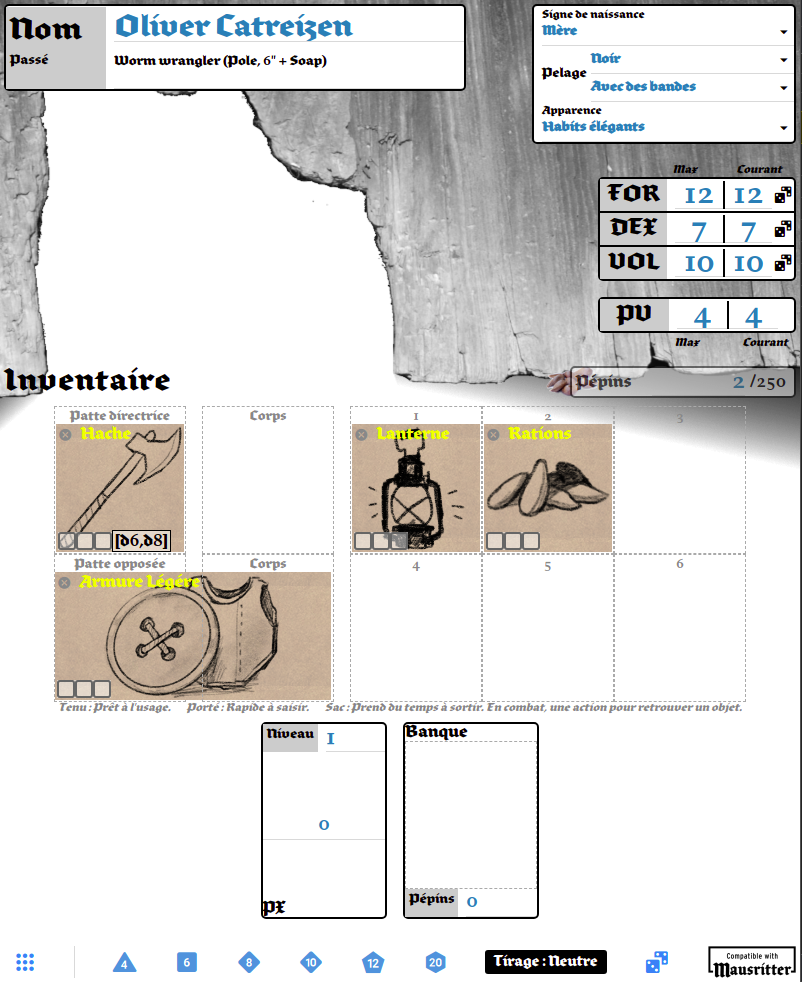

# mausritter-sheet
**Mausritter Character Sheet** is a web application to create **Mausritter** mice.



## Installation

To soon to have one ;-)

## For developpers
This application is made with [Vue.js 3](https://v3.vuejs.org/) and [wave-ui](https://antoniandre.github.io/wave-ui/).

```
npm install
```

### Compiles and hot-reloads for development
```
npm run serve
```

### Compiles and minifies for production
```
npm run build
```

### Lints and fixes files
```
npm run lint
```

### Customize configuration
See [Configuration Reference](https://cli.vuejs.org/config/).
