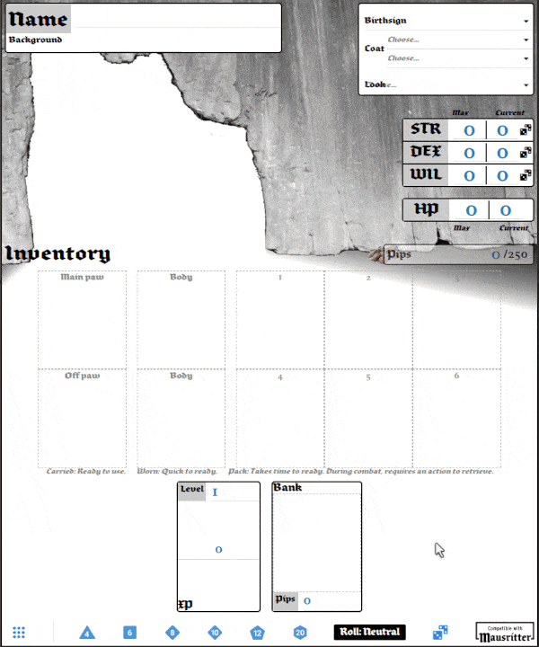

# mausritter-sheet
**Mausritter Character Sheet** is a web application for **Mausritter** mice character sheet.

> Mausritter is about small-scale adventurers in a huge world. Mouse adventurers who take on big challanges and face down grave danger.

Have a look at [Mausritter website](https://mausritter.com/) and [Licence](./LICENSE.md).

## Features
- Play your mouse
- Create a random mouse (implement Mouse creation rules from Mausritter Rules book),
- Translated in English and Français,
- Manage hirelings,
- Roll dices with/without advantage or disadvantage,
- Drag'n'drop items or conditions on inventory slots
- Drag'n'drop in grit.
- Drag'n'drop in bank, retrieving item from bank cost 1% of its price.
- History of dices and other actions.
- Save and load whole character sheet from local storage. 12 slots are available. All data is saved in your browser, no server is needed.
- Import / Export of character sheet. Use this to load a character into another browser.
- Mouse can rest and advance in level, up to level 20.


See [TODO.md](./src/TODO.md) for incomming features :-)



## Installation

Desktop application are available for Microsoft Windows, Apple Mac OS and GNU Linux. At this time, there is no mobile (Android or iOS) version.

Get your application from https://mausritter-shhet.dco.ninja. Go to the welcome page and click on the button "Applications".

## For developpers
This application is made with [Vue.js 3](https://v3.vuejs.org/) and [wave-ui](https://antoniandre.github.io/wave-ui/).

For desktop application, I use [Tauri](https://tauri.studio/en/).

```
yarn
```

### Compiles and hot-reloads for development
```
yarn serve
```

### Compile and hot-reloads for desktop application
```
yarn serve:tauri
```

### Lints and fixes files
```
yarn lint
```

### Compiles and minifies for production
```
yarn build
```

### Build a desktop application
```
yarn build:tauri
```
This will build a native application for your computer.

### Build and run a docker container
If you use **docker-compose**:
```
docker-compose up --build
```
or, with **docker**:
```
yarn build:docker
yarn serve:docker
```

### Customize configuration
See [Configuration Reference](https://cli.vuejs.org/config/).
